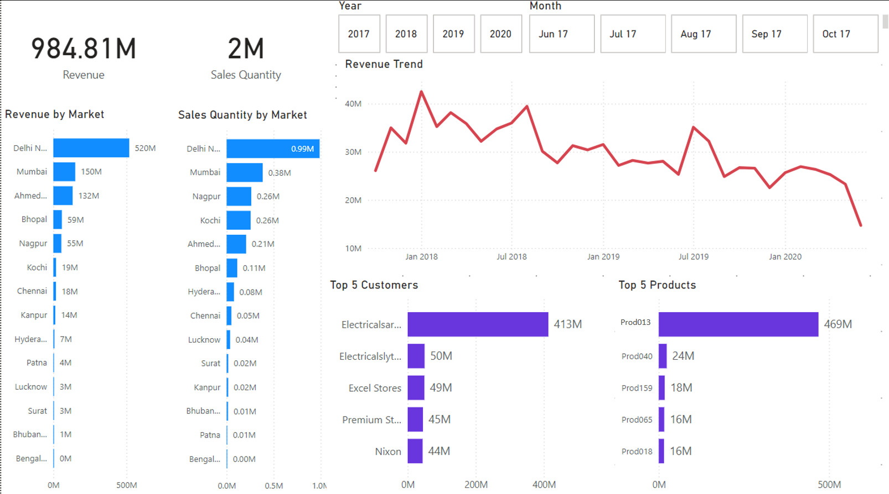
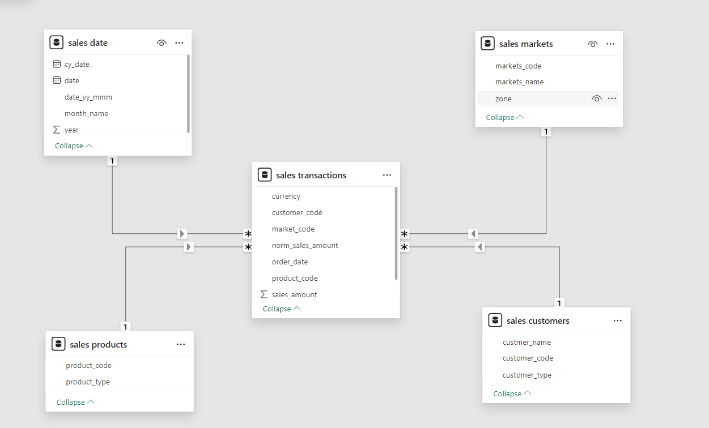

<body>

<h1>Sales Data Analysis and Dashboard Automation</h1>

  This project focuses on analyzing a large sales dataset and automating the delivery of key business insights through a dynamic Power BI dashboard. 
  The primary objective was to streamline the data analysis process, transforming raw data into actionable insights to support data-driven decision-making for the sales team.

<h2>Project Overview</h2>

  The project involved working with a comprehensive sales dataset provided as a MySQL database dump. 
  Using a combination of SQL and Power BI, I performed data cleaning, transformation, and visualization to unlock hidden sales insights. 
  The end result was an automated dashboard that delivers quick, accurate, and up-to-date sales metrics.

<h2>Key Steps and Techniques</h2>
<ul>
  <li><strong>Data Cleaning and Transformation (ETL):</strong>
    <ul>
      <li>Extracted, transformed, and loaded (ETL) data from a MySQL database to ensure consistency and reliability.</li>
      <li>Addressed issues such as missing values, incorrect data formats, and data redundancies to improve data quality.</li>
    </ul>
  </li>
  <li><strong>Data Modeling:</strong>
    <ul>
      <li>Created a star schema data model to structure the data efficiently.</li>
      <li>Established meaningful table relationships to facilitate accurate analysis and reporting.</li>
    </ul>
  </li>
  <li><strong>Dashboard Development:</strong>
    <ul>
      <li>Built an interactive and automated Power BI dashboard.</li>
      <li>Visualized key sales insights, including revenue trends and sales performance metrics.</li>
      <li>Reduced the time needed for manual data gathering and enabled quick decision-making.</li>
    </ul>
  </li>
</ul>

<h2>Technologies Used</h2>
<ul>
  <li><strong>MySQL:</strong> For database management and data extraction.</li>
  <li><strong>Power BI:</strong> For data visualization and dashboard automation.</li>
  <li><strong>SQL:</strong> For querying, cleaning, and transforming data.</li>
</ul>

<h2>Impact</h2>

  This project enhanced the sales team's ability to make informed decisions by providing a clear and efficient view of essential sales data. 
  The automated dashboard minimizes manual data analysis efforts, saving valuable time and ensuring data-driven strategies.

  <!--    -->
  <h2>Dashboard Preview</h2>
  

  <h2>Data Model</h2>
  
  

  

</body>

